# Bí kíp đạt thượng thừa Charles

Contributors: **Tâm Nguyễn M.**, **Hải Phùng N.T**

Tương truyền... Phép màu sẽ đến với ai biết xài Charles. 🙏🏻🙏🏻🙏🏻

**Lưu ý:**

> Bí kíp này không cần tự cung mới luyện được.
> 
> Người anh em hãy luyện bí kíp này cùng Typora để đạt thượng thừa nhanh hơn nhé.

## Mục lục

[Install Charles](#install-charles)

[Configure Charles](#configure-charles)

- [Register Charles](#register-charles)
- [Configuring Browser and System](#configuring-browser-and-system)
  - [Đối với macOS Proxy](#đối-với-macos-proxy)
  - [Đối với iOS Device Setting](#đối-với-ios-device-setting)
  - [Đối với iOS Simulator](#đối-với-ios-simulator)

[Work with Charles Proxy](#work-with-charles-proxy)

- [Application Interface](#application-interface)
- [Debug with Charles](#debug-with-charles)
  - [Focus](#focus)
  - [Recording settings](#recording-settings)
  - [Throttle settings](#throttle-settings)
  - [Breakpoint](#breakpoint)
  - [Handle breakpoint](#handle-breakpoint)
- [Configuring SSL Proxying Certificates](#configuring-ssl-proxying-certificates)
  - [Đối với macOS](#đối-với-macos)
  - [Đối với iOS Device](#đối-với-ios-device)
  - [Đối với iOS Simulator](#đối-với-ios-simulator)
- [Enable SSL Proxying Setting](#enable-ssl-proxying-setting)

[TOC]

## Install Charles

1. Truy cập vào đường link sau: https://www.charlesproxy.com và download file installer về máy

2. Khởi động installer đã down về, hoàn thành theo chỉ dẫn:

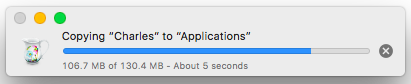

3. Khởi động Charles:

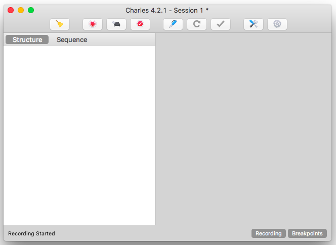

## Configure Charles

### Register Charles

**Help > Register Charles... > Điền Register Name và License Key**

**Lưu ý:** 

> Người anh em hãy liên hệ ông **Đài Hồ V.** để lấy key và name nhoé.

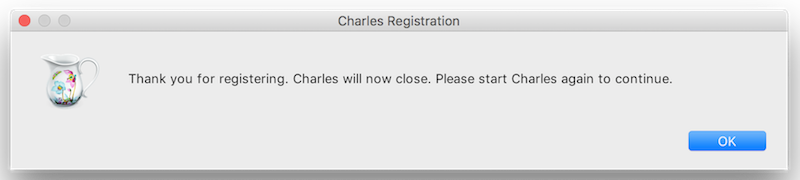

### Configuring Browser and System

#### Đối với macOS Proxy

1. Lần đầu sử dụng Charles bạn sẽ được tự động hỏi về việc cấp quyền macOS Proxy như sau. Chọn **Grant Privileges** và nhập user name và password:
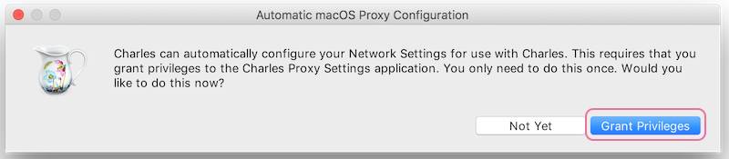

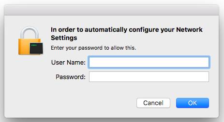

2. Nếu bạn chọn **Not Yet** ở phần **Automatic macOS Proxy Configuration**, lần tới bạn có thế cài đặt thông qua: 
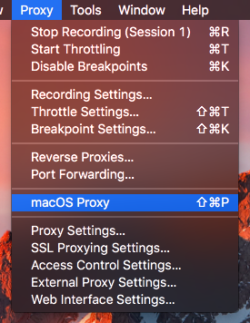

#### Đối với iOS Device Setting

Để sử dụng Charles thay thế cho HTTP proxy trên iPhone, chúng ta cần config bằng tay.

1. Vào **Settings > Wifi**:

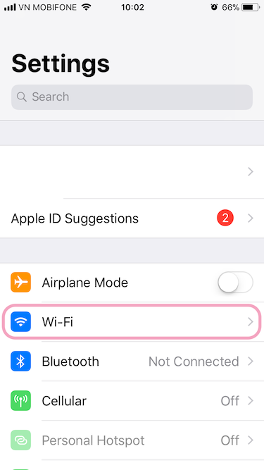

2. Chọn network đang kết nối tới:

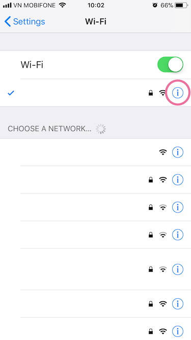

3. Chọn **Config Proxy**:

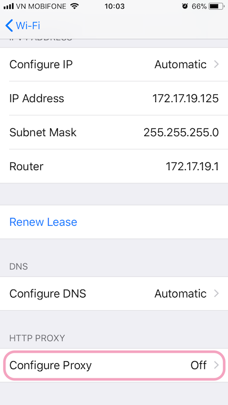

4. Chọn **Manual** và điền vào form, trong đó:
- Server: Địa chỉ IP của máy tính đang chạy Charles
- Port: Cổng mà Charles chạy (thường là 8888)
- Authentication: Off

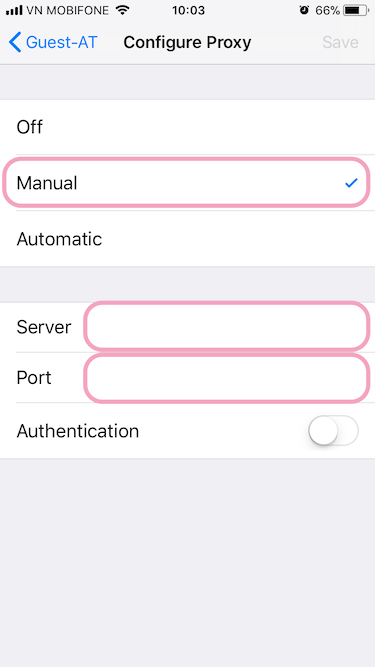

5. Vào **Proxy > Access Control Settings…** để cho phép các device được phép kết nối với Charles bằng cách thêm mới.
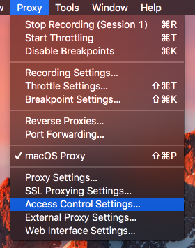

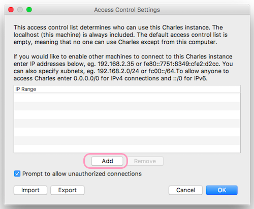

**Cẩn trọng:**
>  Anh em trong giang hồ nhớ tắt **Configure Proxy** trong **Settings** sau khi sử dụng Charles nhoé.
>
>  Không tắt mà còn hỏi thì đừng có trách vì sao nước biển lại mặn.

#### Đối với iOS Simulator

- Simulator sẽ sử dụng system proxy setting như ở phía trên đã đề cập.
- Nếu simulator gặp trục trặc trong việc này, **hãy khởi động lại simulator**.

Tìm hiểu các setting khác ở: https://www.charlesproxy.com/documentation/configuration/

### Configuring SSL Proxying Certificates

#### Đối với macOS

1. **Help > SSL Proxying > Install Charles Root Certificates**

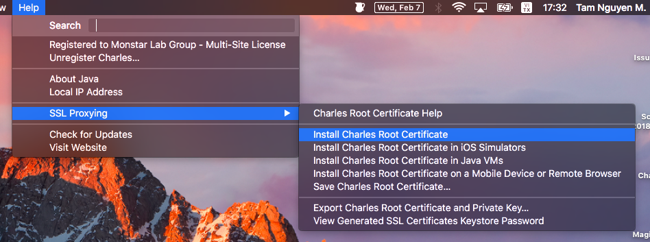

2. Thêm **Certificates**:

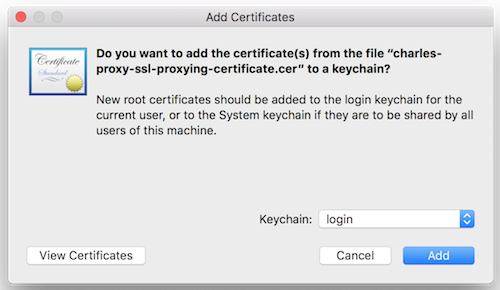

3. Chọn **Charles Proxy CA**:

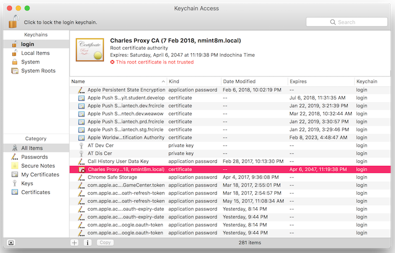

4. Chọn **Always Trust**:

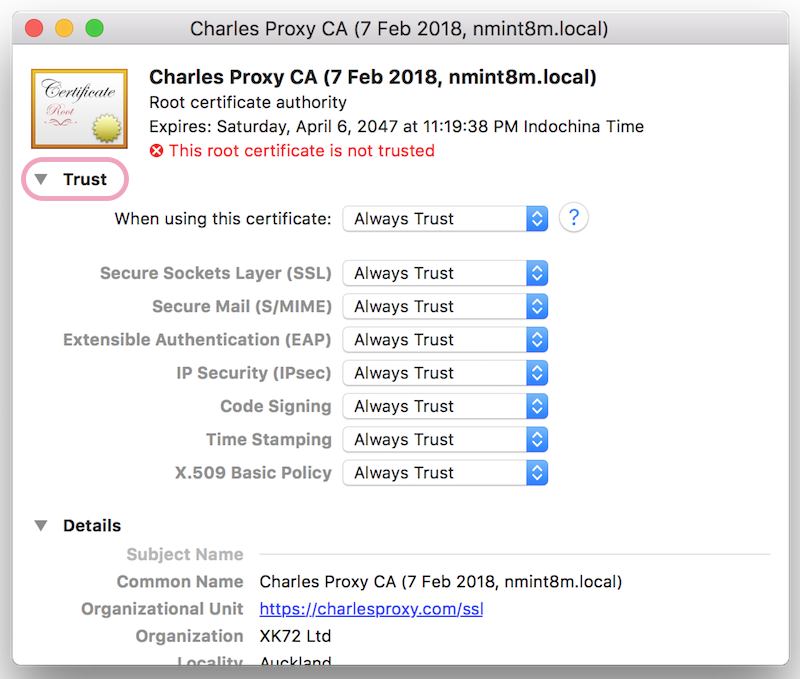

5. Kết quả sẽ được như sau, khởi động lại Safari việc thay đổi được áp dụng:

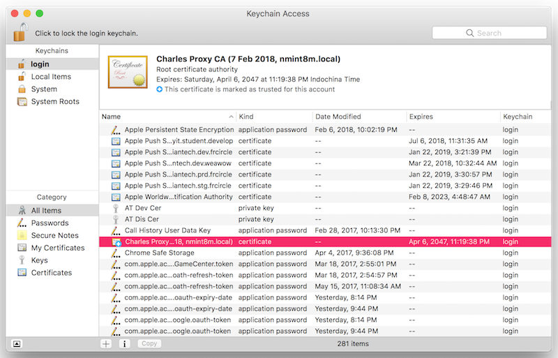

#### Đối với iOS Device

- Cài đặt iOS device để sử dụng Charles thay thế cho HTTP proxy trên iPhone trong **Settings > Wifi settings**
- Mở Safari và truy cập tới https://chls.pro/ssl. Safari sẽ install SSL certificate.
- Đối với iOS 10.3 trở về sau, chúng ta sẽ thực hiện:
  - **Settings > General > About > Certificate Trust Settings.** 
  - Dưới mục **Enable full trust for root certificates**, bật cetificate cho Charles Proxy.

#### Đối với iOS Simulator
- Tắt tất cả simulator
- Bật Charles và thực hiện vào **Help** > SSL Proxying > Install Charles Root Certificate in iOS Simulators
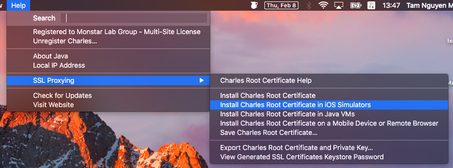

- Cách trên **đôi khi không thành công**. Ta có thể thực hiện như sau:
  - **Help > SSL Proxying > Save Charles Root Certificate…** để lưu file *.pem
  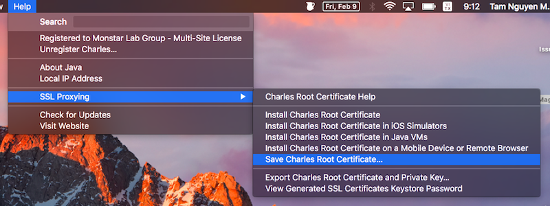

  - Kéo thả file *.pem vừa tạo vào simulator

  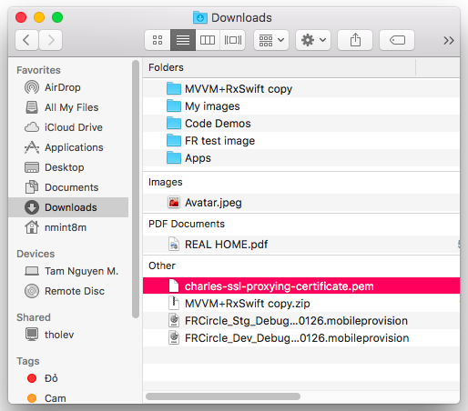

  - Thực hiện cài đặt certificate cho simulator

  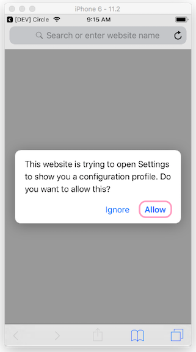

  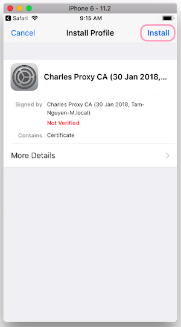

  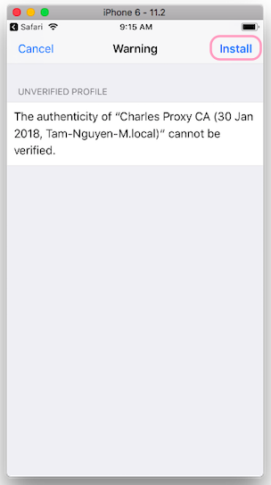

  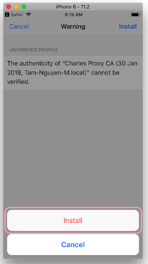

  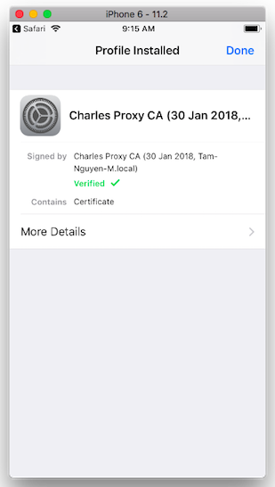

**Lưu ý:** Các vị huynh đài kiểm tra Simulator lần nữa cho chắc nhé. 

1. **Setting > General > About > Certificate Trust Settings.**
2. Turn on certificate của Charles.

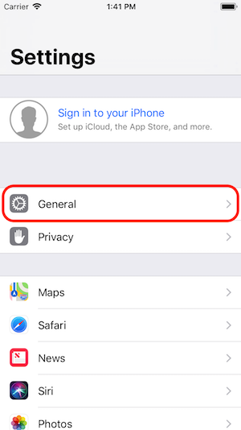

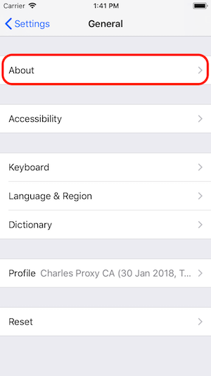

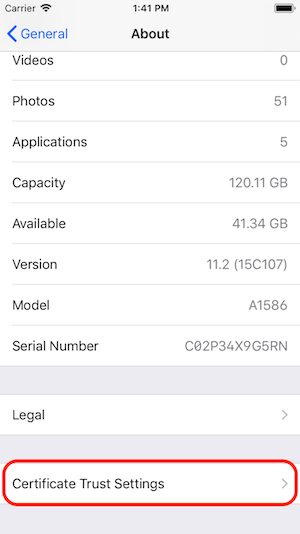

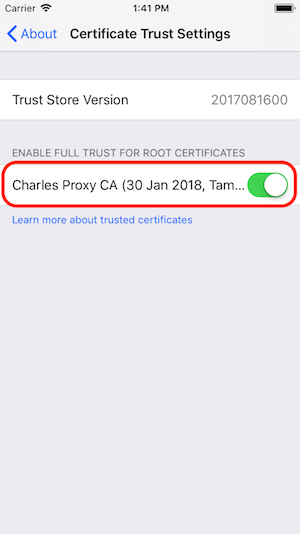

### Enable SSL Proxying Setting

1. **Proxy > SSL Proxying Settings...**

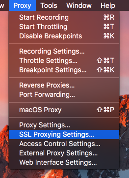

2. Ở tab **SSL Proxying**, chọn **Enable SSL Proxying**.

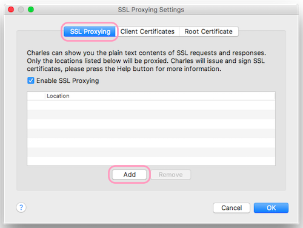

3. Thêm **Location**.

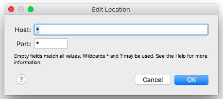

**Lưu ý: **
> Người anh em nên vận công restart lại máy cho chắc.

## Work with Charles Proxy

### Application Interface

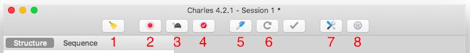

Các nút thông dụng: 

1. **Clear the current session**: 
   - Session chứa tất cả các thông tin được ghi lại. 
   - Khi Session đầy/busy, có thể clean session đấy.

2. **Start/stop recording**:
   - Record là chức năng căn bản của Charles. 
   - Request và response được lưu lại vào Session hiện tại chỉ khi chức năng Record bật.
     - Request hiển thị trên màn hình Session khi nó được lưu lại. Có thể xem request ở 2 chế độ: Structure và Sequence.

3. **Start/stop throttling**: Điều chỉnh băng thông

4. **Enable/Disable breakpoints**

5. Tạo **Compose** mới

6. **Repeat**: Lặp lại request được chọn

7. **Tool**: Active/deactive các tool như
   - Breakpoint
   - No caching
   - ...

8. **Settings**:
   - Recording settings…
   - Access control settings...
   - ...​

### Debug with Charles

**Lưu ý:**
> Người anh em nhớ bật macOS Proxy trước khi debug, bằng cách vào **Proxy > macOS Proxy** như đã đề cập phía trên nhé.

#### Focus

Vì có rất nhiều request và response từ vô số host trả về. Bước focus này giúp tách riêng những host chúng ta cần quan tâm.

1. Vào **View > Focused Host > Add focused hosts…**

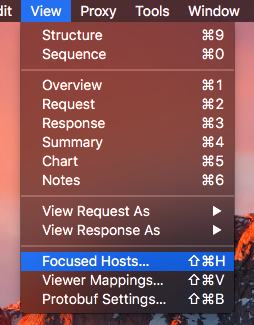

2. Adding host: 
Ex: *.frcircle.com

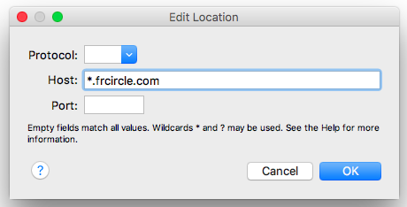

3. Kết quả:

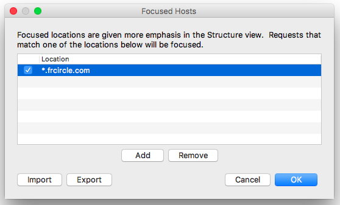

#### Recording settings

Bước này dùng để lọc ra những thứ mà chúng ta sẽ record lại trong session.

1. Vào **Settings** của session cần lọc, hoặc vào **Proxy > Recording Settings...**:

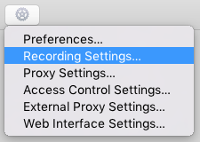

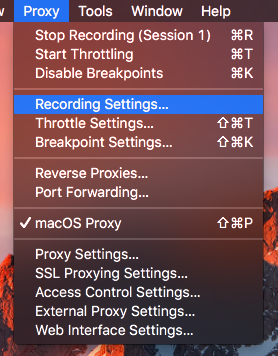

2. Chọn tab **Include**:

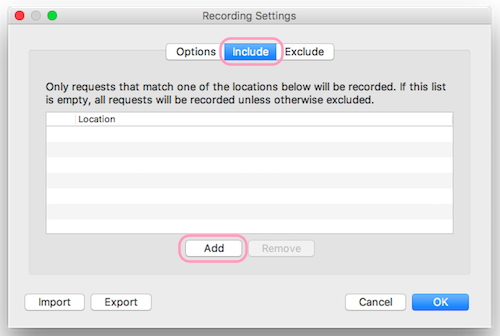

3. Thêm Locations:

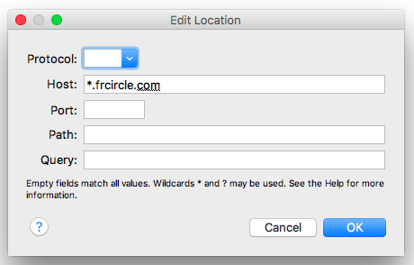

4. Kết quả:

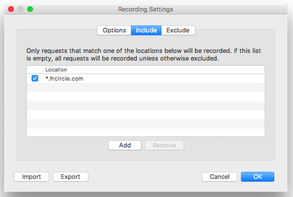

#### Throttle settings

Điều chỉnh băng thông với throttle settings:

1. Vào **Proxy > Throttle Settings...**

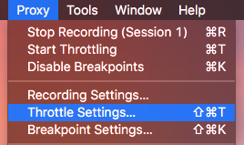

2. Config throttle setting

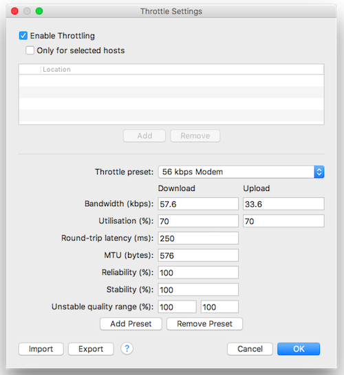

#### Breakpoint

Tạo break point để debug:

1. Vào **Proxy > Breakpoint Settings...**

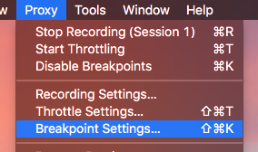

2. Thêm breakpoint:
   - Adding path: v1/item/search

   - Add query: *im_name=292508-69&page=1&result_limit=100&sort_type=recent*

   - Check breakpoints: *request/response*

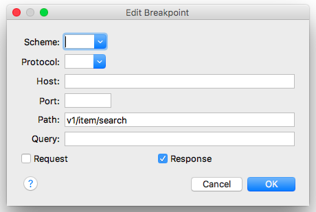

3. Kết quả:

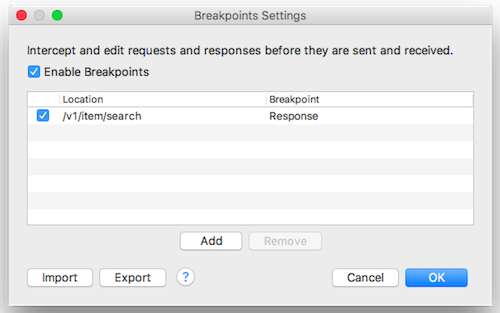

**Tương truyền:**
>- Fill host ở Breakpoint settings trong khi trước đó đã fill host ở Record settings, thì tất cả request của anh em trong giang hồ đều gặp thất bại.
>- Những host được đặt trong Focus là những host ta bảo Charles để mắt tới.
>- Nhưng những host được đặt trong Record settings là những host ta bảo Charles theo dõi rồi ghi sớ dâng cho ta.

#### Handle breakpoint

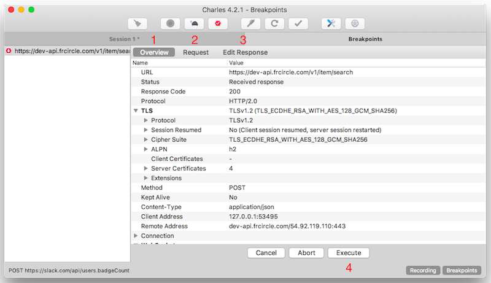

1. Tab **Overview**

2. Tab **Request**

3. Tab **Edit Response**
   - Header: Editing header
   - JSON text: Editing body

4. **Execute** để tiếp tục

