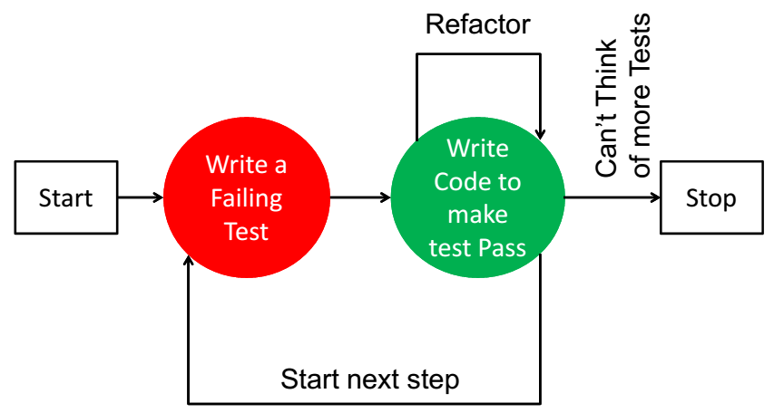
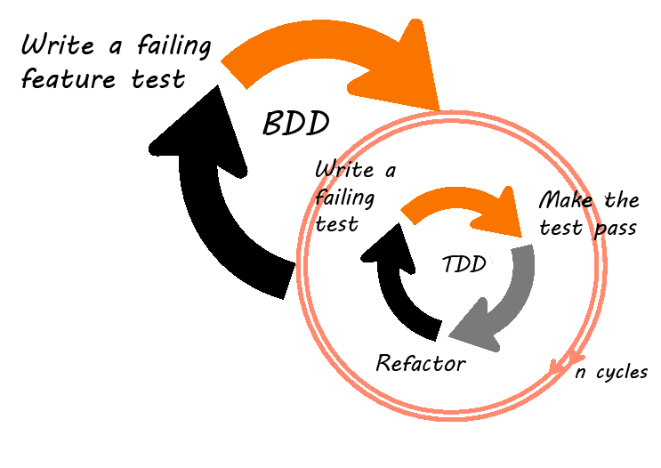
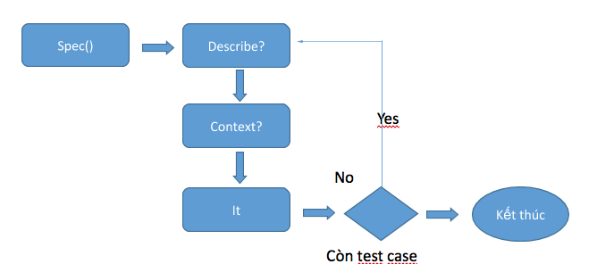

# Quick

## Giới thiệu

### TDD và BDD

#### Tổng quan về TDD:
Phát triển hướng kiểm thử TDD (Test-Driven Development) là một phương pháp tiếp cận cải tiến để phát triển phần mềm. Trong đó kết hợp phương pháp:
- Phát triển kiểm thử trước (Test First Development) 
- Điều chỉnh lại mã nguồn (Refactoring). 
Mục tiêu quan trọng nhất của TDD là hãy nghĩ về thiết kế của bạn trước khi viết mã nguồn cho chức năng.

Một quan điểm khác lại cho rằng TDD là một kỹ thuật lập trình. Nhưng nhìn chung, mục tiêu của TDD là viết mã nguồn sáng sủa, rõ ràng và có thể chạy được.

##### Các bước để thực hiện TDD:
- Bước 1: Viết 1 test cho hàm mới. Đảm bảo rằng test sẽ fail.
- Bước 2: Chuyển qua viết code sơ khai nhất cho hàm đó để test có thể pass.
- Bước 3: Tối ưu hóa đoạn code của hàm vừa viết sao cho đảm bảo test vẫn pass và tối ưu nhất cho việc lập trình kế tiếp
- Bước 4: Lặp lại cho các hàm khác từ bước 1

##### Mô hình:



<math display="block">
    <mo><b>Mô hình TDD</b></mo>
</math>


#### Tổng quan về BDD:
BDD (Behavior Driven Development) là một quá trình phát triển phần mềm dựa trên phương pháp Agile (phát triển phần mềm linh hoạt).

BDD là sự mở rộng của TDD (Test Driven Development). Thay vì tập trung vào phát triển phần mềm theo hướng kiểm thử, BDD tập trung vào phát triển phần mềm theo hướng hành vi.

Dựa vào requirement các kịch bản test (Scenarios) sẽ được viết trước dưới dạng ngôn ngữ tự nhiên và dễ hiểu nhất sau đó mới thực hiện cài đặt source code đễ pass qua tất cả các stories đó.

##### Các bước để thực hiện BDD:
BDD được viết dưới dạng plain text language gọi là Gherkin. Cú pháp gherkin chia thành 3 thành phần chính là `feature`, `scenario` và `step`.

Mỗi file gồm một Feature

- Mỗi Feature gồm nhiều Scenario, bắt đầu bằng từ khóa “Feature:”. Mỗi Feature là 1 chức năng
- Mỗi Scenario gồm nhiều step, bắt đầu bằng từ khóa “Scenario:”. Mỗi Scenario là một testcase. 
- Mỗi step sẽ bắt đầu bằng các keyword như Given, When, Then, But hoặc And Trong đó: 
 - “Given”: Mô tả ngữ cảnh ban đầu của hệ thống 
 - “When”: Mô tả hành vi 
 - “Then”: Mô tả kết quả 
 - “And”, “But”: Kết hợp nhiều step giống nhau

##### Mô hình:



<math display="block">
    <mo><b>Mô hình BDD</b></mo>
</math>


### Quick là gì?

Quick là một khuôn khổ phát triển dựa trên hành vi (BDD) được thiết kế cho Swift và Obj-C và được xây dựng trên XCTest, cung cấp một phương pháp thuận tiện để soạn một bài kiểm tra đơn vị. Nó sử dụng 1 hàm duy nhất `spec()` để xác định toàn bộ một bộ test. Trong `spec()` bao gồm nhiều phần: `describe`,
`context` và `it`.

Quick sử dụng một cú pháp đặc biệt để xác định các testcase và các nhóm testcase nhằm phục vụ 2 mục đích:

- Rõ nghĩa các mục đích của test bằng việc viết các mô tả cho từng test case hay các nhóm testcase

- Đơn giản hoá các mã kiểm tra trong bước sắp xếp các testcase của bạn

### Ví dụ đơn giản

```swift
import Quick
import Nimble

@testable import QuickDemo

final class MoviesViewModelTest: QuickSpec {

    override func spec() {

        var viewModel: MoviesViewModel!

        describe("Movies view model") {

            context("When movie is not nil") {

                beforeEach {
                    viewModel = MoviesViewModel()
                    let movies = MoviesDataHelper.getMovies()
                    viewModel.movies = movies
                }

                it("Number of item should be return 8 movies") {
                    expect(viewModel.numberOfItems(inSection: 0)) == 8
                }

                it("Movies cell view model should be an instance of MoviesCellViewModel") {
                    let indexPath = IndexPath(row: 0, section: 0)
                    expect { try viewModel.viewModelForItem(at: indexPath) }
                        .to(beAnInstanceOf(MoviesCellViewModel.self))
                }

                it("Error should be index is out of bounds") {
                    let indexPath = IndexPath(row: 100, section: 0)
                    expect { try viewModel.viewModelForItem(at: indexPath) }
                        .to(throwError())
                }
            }

            afterEach {
                viewModel = nil
            }
        }
    }
}

```

## Cài đặt

Bạn có thể cài đặt `Quick` bằng cách sử dụng Cocoapod để thêm vào tệp Podfile như sau:

```swift
platform :ios, '9.0'

target 'QuickDemo' do
  use_frameworks!

  # Pods for QuickDemo

  target 'QuickDemoTests' do
      inherit! :complete
      pod 'Nimble', '7.0.2'
      pod 'Quick', '1.2.0'
  end
end
```
## Life cycle



<math display="block">
    <mo><b>Vòng đời của test class</b></mo>
</math>

## Các cú pháp cơ bản
#### `describe`: 
- Là một gói các testcase có cùng một chức năng. Mô tả chính xác phần mà bạn đang kiểm tra.

#### `context`:
- Là một gói các testcase có cùng một chức năng. Mô tả chính xác phần mà bạn đang kiểm tra.

#### `it`:
- Mô tả kết quả dự kiến của phần mà bạn muốn kiểm tra. Đây là trường hợp kiểm tra chính xác và được coi là một test case.

Theo như định nghĩa trên thì  đối tượng phải được khai báo trong `context`. Trạng thái của nó phải được sửa đổi trong `context` hoặc `it` và mong muốn phải đúng với kết quả của `it`. Và cần nhớ cấu trúc được sử dụng từ trên xuống , được khai báo trong phần `describe` và được chia sẻ giữa các `contexts`.

##Các chú ý khi sử dụng


***Lưu ý:***

- Từ khoá `context` là một từ đồng nghĩa với mô tả, tuy nhiên nếu sử dụng thích hợp thì sẽ làm cho `spec()` của bạn dễ hiểu hơn. 

### Testcase sử dụng `it`:

- Được định nghĩa với chức năng `it`, sử dụng thể khẳng định để chứng minh đoạn mã nên trả về như thế nào?

- `it` có hai tham số: mô tả của testcase và một closure. Mô tả không giới hạn độ dài và được sử dụng tất cả mọi ký tự.

### Nhóm testcase sử dụng `describe` và `context`:

- Nhóm testcase là các nhóm hợp lý của các test case. Các nhóm testcase được sử dụng chung setup() và teardown().

**Mô tả các lớp và các phương thức sử dụng `describe`**:

- Để kiểm tra một phương thức hoạt động, một vài testcase `it` được nhóm lại với nhau bằng cách thức sử dụng chức năng `describe`. Nhóm các testcase tương tự lại với nhau làm cho spec() dễ đọc hơn.

*Một tính năng khác mà hay được sử dụng khi dùng Quick là: `beforeEach` và `afterEach`*

### BeforeEach và AfterEach:

**Cách thức sử dụng:**

- Sử dụng giống hai hàm `setup()` và `teardown()` ở XCTest
- Được thực hiện ở đầu và cuối mỗi trường hợp kiểm tra `it`
- Có thể được định nghĩa bên trong bất kỳ `describe` hay `context`
- Nếu chúng có mặt trong cả `context` và `describe` thì `beforeEach` sẽ chạy đầu tiên ở `describe` rồi mới chạy trong `context`, còn `afterEach` sẽ ngược lại, chạy ở `context` trước rồi mới tới `describe`
- Bất kỳ biến nào được gán giá trị trong `beforeEach` có thể sử dụng bên trong thân của `it`

Ví dụ:

```swift
import Quick

class Spec: QuickSpec {

  override func spec() {

    describe("beforeEach and afterEach behaviour") {

      beforeEach {
        print("⭐️ top before each")
      }

      context("some context") {

        beforeEach {
          print("👉 context before each")
        }

        it("example 1") { print("😊 example 1") }

        it("example 2") { print("😊 example 2") }

        it("example 3") { print("😊 example 3") }

        afterEach {
          print("👉 context after each")
        }
      }

      context("another context") {

        beforeEach {
          print("🍎 context before each")
        }

        it("example 1") { print("😜 example 1") }

        it("example 2") { print("😜 example 2") }

        afterEach {
          print("🍎 context after each")
        }
      }

      afterEach {
        print("⭐️ top after each")
      }
    }
  }
}

```

Kết quả chạy sẽ là:

```swift
behaviour - some context - example 1
⭐️ top before each
👉 context before each
😊 example 1
👉 context after each
⭐️ top after each

behaviour - some context - example 2
⭐️ top before each
👉 context before each
😊 example 2
👉 context after each
⭐️ top after each

behaviour - some context - example 3
⭐️ top before each
👉 context before each
😊 example 3
👉 context after each
⭐️ top after each

behaviour - other context - example 1
⭐️ top before each
🍎 context before each
😜 example 1
🍎 context after each
⭐️ top after each

behaviour - other context - example 2
⭐️ top before each
🍎 context before each
😜 example 2
🍎 context after each
⭐️ top after each

```
### BeforeSuite và AfterSuite:

Một số thiết lập thử nghiệm cần được thực hiện trước khi bất kỳ các trường hợp kiểm tra nào được chạy. Trong trường hợp đó thì ta cần sử dụng `beforeSuite` và `afterSuite`.

**Cách thức sử dụng:**

- `BeforeSuite`: Xác định một closure sẽ được **chạy trước tiên** bất kỳ các testcase nào và chạy một lần duy nhất trong một bộ thử nghiệm. Bạn có thể định nghĩa nhiều `BeforeSuite` nhưng không có gì đảm bảo về thứ tự mà chúng đang chạy.

- `AfterSuite`: Xác định một closure sẽ được **chạy sau cùng** bất kỳ các testcase nào và chạy một lần duy nhất trong một bộ thử nghiệm. Bạn có thể định nghĩa nhiều `AfterSuite` nhưng không có gì đảm bảo về thứ tự mà chúng đang chạy.

```swift
import Quick

class Spec: QuickSpec {
  override func spec() {
    beforeSuite {
      print("☕️ before suite")
    }

    describe("beforeEach and afterEach behaviour") {
      beforeEach {
        print("⭐️ top before each")
      }

      context("some context") {
        beforeEach {
          print("👉 context before each")
        }

        it("example 1") { print("😊 example 1") }

        it("example 2") { print("😊 example 2") }

        afterEach {
          print("👉 context after each")
        }
      }

      afterEach {
        print("⭐️ top after each")
      }
    }

    afterSuite {
      print("🗑 after suite")
    }
  }
}
```

Kết quả chạy sẽ là:

```swift
☕️ before suite

behaviour - some context - example 1
⭐️ top before each
👉 context before each
😊 example 1
👉 context after each
⭐️ top after each

behaviour - other context - example 2
⭐️ top before each
🍎 context before each
😜 example 2
🍎 context after each
⭐️ top after each

🗑 after suite
```

**Một số lưu ý khi sử dụng `beforeSuite` và `afterSuite`:**

- Trong một class test chỉ nên định nghĩa `beforeSuite` và `afterSuite` một lần duy nhất để đảm bảo về thứ tự chạy của mỗi closure trong class đó.

- Trong một dự án bạn có thể chỉ định càng nhiều càng tốt các `beforeSuite` và `afterSuite` như bạn muốn. Tất cả các closure `beforeSuite` sẽ được thực hiện trước khi bất kì các class test nào được chạy, và tất cả các closure `afterSuite` sẽ được thực hiện khi tất cả các testcase được kiểm tra hết.

- Khi chạy một class test thì closure `beforeSuite` sẽ được thực hiện nhưng closure `afterSuite` sẽ không được thực hiện trừ khi test toàn bộ project.
